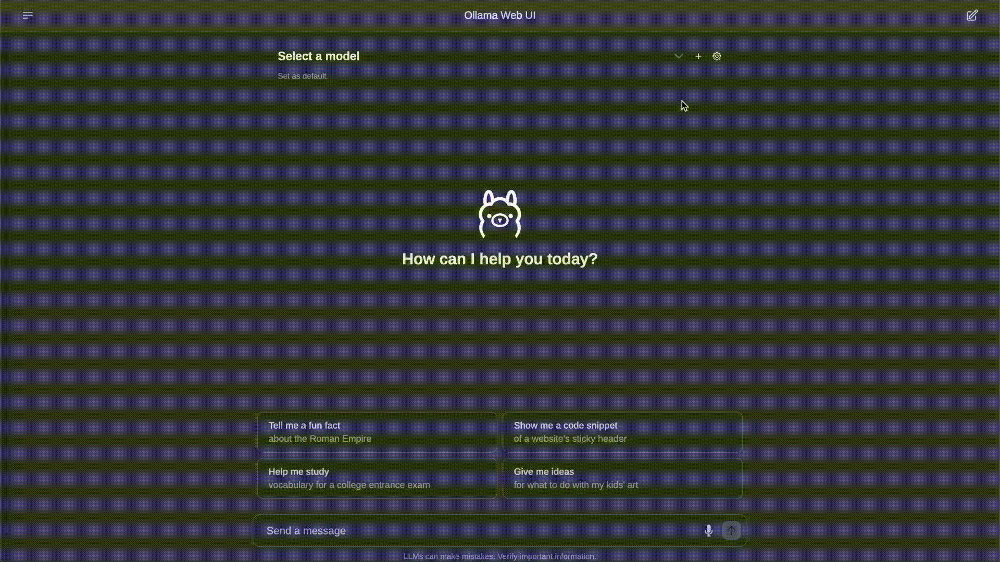

# Adaptify - AI Model Orchestrator: A Cognitive Toolkit for Dynamic Use Cases👋



## Key Features of Open WebUI ⭐

- 🚀 **Effortless Setup**: Install seamlessly using Docker or Kubernetes (kubectl, kustomize or helm) for a hassle-free experience with support for both `:ollama` and `:cuda` tagged images.

- 🤝 **Ollama/OpenAI API Integration**: Effortlessly integrate OpenAI-compatible APIs for versatile conversations alongside Ollama models. Customize the OpenAI API URL to link with **LMStudio, GroqCloud, Mistral, OpenRouter, and more**.

- 📱 **Responsive Design**: Enjoy a seamless experience across Desktop PC, Laptop, and Mobile devices.

- 📱 **Progressive Web App (PWA) for Mobile**: Enjoy a native app-like experience on your mobile device with our PWA, providing offline access on localhost and a seamless user interface.

- ✒️🔢 **Full Markdown and LaTeX Support**: Elevate your LLM experience with comprehensive Markdown and LaTeX capabilities for enriched interaction.

- 🎤📹 **Hands-Free Voice/Video Call**: Experience seamless communication with integrated hands-free voice and video call features, allowing for a more dynamic and interactive chat environment.

- 🛠️ **Model Builder**: Easily create Ollama models via the Web UI. Create and add custom characters/agents, customize chat elements.

- 🐍 **Native Python Function Calling Tool**: Enhance your LLMs with built-in code editor support in the tools workspace. Bring Your Own Function (BYOF) by simply adding your pure Python functions, enabling seamless integration with LLMs.

- 📚 **Local RAG Integration**: Dive into the future of chat interactions with groundbreaking Retrieval Augmented Generation (RAG) support. This feature seamlessly integrates document interactions into your chat experience. You can load documents directly into the chat or add files to your document library, effortlessly accessing them using the `#` command before a query.

- 🔍 **Web Search for RAG**: Perform web searches using providers like `SearXNG`, `Google PSE`, `Brave Search`, `serpstack`, `serper`, `Serply`, `DuckDuckGo`, `TavilySearch` and `SearchApi` and inject the results directly into your chat experience.

- 🌐 **Web Browsing Capability**: Seamlessly integrate websites into your chat experience using the `#` command followed by a URL. This feature allows you to incorporate web content directly into your conversations, enhancing the richness and depth of your interactions.

- 🎨 **Image Generation Integration**: Seamlessly incorporate image generation capabilities using options such as AUTOMATIC1111 API or ComfyUI (local), and OpenAI's DALL-E (external), enriching your chat experience with dynamic visual content.

- ⚙️ **Many Models Conversations**: Effortlessly engage with various models simultaneously, harnessing their unique strengths for optimal responses. Enhance your experience by leveraging a diverse set of models in parallel.

- 🔐 **Role-Based Access Control (RBAC)**: Ensure secure access with restricted permissions; only authorized individuals can access your Ollama, and exclusive model creation/pulling rights are reserved for administrators.

- 🌐🌍 **Multilingual Support**: Experience Open WebUI in your preferred language with our internationalization (i18n) support. Join us in expanding our supported languages! We're actively seeking contributors!

## How to Install 🚀

### Frontend Setup
1. **Clone the Repository**:
   ```bash
   git clone https://github.com/Raghul-18/Adaptify.git
   
2. **Navigate to the Frontend Directory**:
   ```bash
   cd Adaptify

3. **Install Dependencies**:
   ```bash
   npm install

4. **Run the Development Server**:
   ```bash
   npm run dev

### Backend Setup
1. **Navigate to Backend Directory**:
   ```bash
   cd Adaptify/Backend

2. **Start the server**:
   ```bash
   Click on start_windows.bat

## Ollama Setup 🦙

### Download Ollama:
* Visit Ollama's official [website]:(https://ollama.com/download)
* Download the server software for your system (Windows, macOS, or Linux).

### Start the Ollama Server:
* Once installed, start the server by running the following command in your terminal:
  ```bash
  ollama serve
* Install the desired model from [Library](https://ollama.com/library)
  ```bash
  ollama pull llama3.2
  

